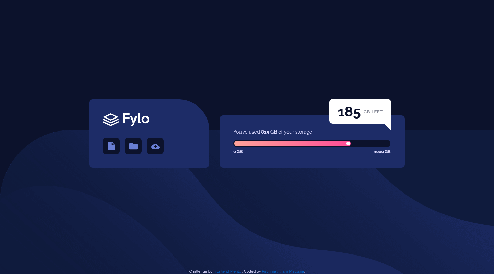

# Frontend Mentor - Fylo data storage component solution

This is a solution to the [Fylo data storage component challenge on Frontend Mentor](https://www.frontendmentor.io/challenges/fylo-data-storage-component-1dZPRbV5n). Frontend Mentor challenges help you improve your coding skills by building realistic projects.

## Table of contents

- [Overview](#overview)
  - [The challenge](#the-challenge)
  - [Screenshot](#screenshot)
  - [Links](#links)
- [My process](#my-process)
  - [Built with](#built-with)
  - [What I learned](#what-i-learned)
  - [Continued development](#continued-development)
- [Author](#author)

## Overview

### The challenge

Users should be able to:

- View the optimal layout for the site depending on their device's screen size

### Screenshot

### Links

- Solution URL: [Solution page on Frontend Mentor](https://www.frontendmentor.io/solutions/fylo-data-storage-component-BJMNce_85)
- Live Site URL: [Github Pages](https://rachmatilham.github.io/fylo-data-storage-component-master/)

## My process

### Built with

- Semantic HTML5 markup
- CSS custom properties
- Flexbox
- Mobile-first workflow

### What I learned

I learned to use border to make a triangle.

### Continued development

I will continue to improve my skill to be able to make more challenging pages.

## Author

- Github - [Rachmat Ilham Maulana](https://github.com/rachmatilham)
- Frontend Mentor - [@rachmatilham](https://www.frontendmentor.io/profile/rachmatilham)
